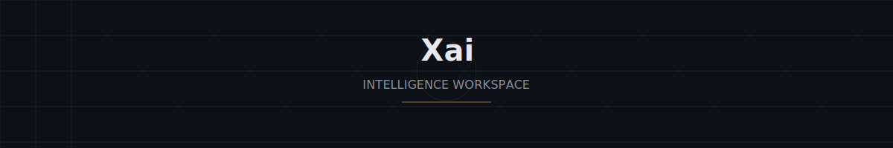

<p align="center">
  <strong>From raw data → structured intelligence → actionable insight → automation.</strong>
</p>

<p align="center">
  <br>
  <a href="#-sections">Sections</a> •
  <a href="docs/ARCHITECTURE.md">Architecture</a> •
  <a href="docs/ANIMATION.md">Animation</a> •
  <a href="docs/DESIGN-SYSTEM.md">Design</a> •
  <a href="docs/COMPONENTS.md">Components</a> •
  <a href="docs/GETTING-STARTED.md">Setup</a>
</p>

---

A single-page interactive product experience that visualises how **Xai**
turns raw data into structured intelligence. Built with Next.js 15,
Three.js, GSAP, and Framer Motion. Designed for decision-makers who think
in systems, not slides.

The entire page is built around one continuous visual device: a coordinate
lattice that starts scattered and progressively snaps into structure as you
scroll. Every section reads the same scroll progress, so the transformation
feels like one system under tension — not four disconnected demos.

---

## Sections

| #   | Section                                                | Core technology | What happens                                                                                                                              |
| --- | ------------------------------------------------------ | --------------- | ----------------------------------------------------------------------------------------------------------------------------------------- |
| 1   | **Hero** · Data → Intelligence                         | Three.js / R3F  | 800 particles morph from chaotic scatter to flat grid as you scroll. Connector lines appear between neighbours at >50% structure.         |
| 2   | **Insight Flow** · Ingestion → Decision                | GSAP + SVG      | Pinned for 300% scroll. An SVG visualisation of 48 particles smoothly interpolates through three states: scattered → clustered → gridded. |
| 3   | **Dashboard Preview** · Structure, made usable         | Framer Motion   | Mock product dashboard — sidebar, SVG bar chart, animated data table, tabbed panels with `AnimatePresence` transitions.                   |
| 4   | **Signature Interaction** · Every cluster, reorganised | Three.js / R3F  | A 14×14 grid of glowing boxes extrudes upward in a wave. Mouse influence pushes nearby nodes. Pulsing core sphere.                        |

---

## Quick Start

```bash
npm install
npm run dev
```

Open [http://localhost:3000](http://localhost:3000).

[Full setup guide →](docs/GETTING-STARTED.md)

---

## Tech Stack

```
Framework     Next.js 15 (App Router)
Animation     Framer Motion + GSAP + ScrollTrigger
3D            Three.js + React Three Fiber + Drei
Styling       Tailwind CSS (custom design tokens)
Fonts         Inter (UI) + JetBrains Mono (code, labels)
```

---

## Animation Philosophy

Three tools, one shared rhythm. GSAP owns page-level narrative (the
scroll-driven transformation). Framer Motion owns component-level
interaction (hover, tabs, entrances). Three.js owns geometry (particles,
lattice). All three draw from the same easing curves in
`lib/animation/easings.ts`.

```
confident  ───────────────────────────►  gradual settle — section entrances
precise    ────────►                    quick, snappy — hover, tabs
snap       ────────────────╾───►        overshoot — grid nodes snapping in
```

Three named curves, every tool reads from the same source.

[Full animation guide →](docs/ANIMATION.md)

---

## Architecture in One Diagram

```
Scroll Position
       │
       ▼
useScrollProgress ────► Hero particle morph
       │                  │
       ▼                  ▼
useInsightProgress    DataMorph SVG (48 particles × 3 states)
       │
       ▼
   activeStage ─────────► StageCard reveals
       │
       ▼
DashboardPreview ──────► Framer Motion entrances + AnimatePresence tabs
       │
       ▼
SignatureInteraction ──► R3F extruding lattice + mouse influence
```

[Full architecture guide →](docs/ARCHITECTURE.md)

---

## Design System

The page lives in deep shadow (`#0D1117`). Every surface lifts one shade
brighter (`#161B22`), hover targets another (`#1C2129`). Two accent colours
drive interaction: **amber** (`#FFB454`) for everything clickable, active,
and highlighted; **green** (`#3FB950`) for completion states.

Type uses **Geist** by default and **JetBrains Mono** for data — labels,
stats, the navbar brand. Seven sizes, each with a clear job: the hero
headline commands at 64 px, section titles lead at 40 px, cards work at
24 px, and body copy settles at 16 px. Labels sit at 11 px with tight
letter-spacing, reading like instrument-panel markings.

All tokens are defined in `tailwind.config.ts` for Tailwind and duplicated
in `lib/constants.ts` for Three.js (which cannot read Tailwind classes).

[Full design system →](docs/DESIGN-SYSTEM.md)

---

## Project Structure

```
app/                  Route files only (page, layout, error, loading, not-found)
components/
  sections/
    hero/             R3F particle field
    insight-flow/     GSAP pin + DataMorph SVG
    dashboard-preview/ Framer Motion dashboard
    signature-interaction/ R3F extruding lattice
  ui/                 Shared: navbar, footer, grid-background, button
lib/
  animation/          easings.ts, useScrollProgress
  constants.ts        Palette, spacing, GRID_UNIT
  useReducedMotion.ts Accessibility hook
```

[Full component reference →](docs/COMPONENTS.md)

---

## Accessibility

- `prefers-reduced-motion` respected globally (CSS) and per-scene (JS)
- Visible focus states on all interactive elements
- `aria-hidden="true"` on decorative SVG lattice
- Colour contrast passes WCAG AA (minimum 4.5:1)

---

<p align="center">
  <sub>Built with curiosity, restraint, and a conviction that data wants to become structure.</sub>
</p>
